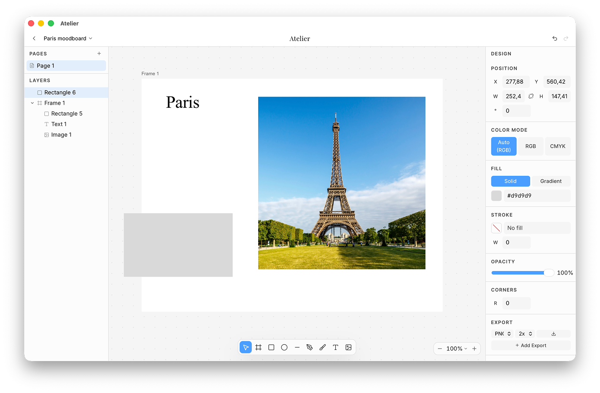

# Atelier

**A local-first vector design tool for brand design, moodboards, and graphic design.**

Atelier is a focused workspace for sketching ideas, drawing vector marks, building moodboards, and putting together identity systems. It runs in your browser or as a native desktop app. There is no subscription or account, and your projects stay on your machine.

**[Try it in your browser →](https://atelier-glauser.vercel.app)**. No install or account required.



## Highlights

- **Vector tools:** A pen tool, freehand drawing, path editing, and boolean operations for union, subtract, intersect, and exclude.
- **Advanced vector editing:** Offset paths, expanded strokes, non-destructive masks, and compound paths with even-odd holes.
- **CMYK soft proofing:** Preview how colors and images may behave in print.
- **Typography:** Use installed system fonts, browse Google Fonts, and convert text to editable outlines. WOFF2 fonts are decoded locally in the browser. Balanced and pretty text wrapping, small caps, case transforms, and per-character kerning.
- **Frames, groups, and layers:** Nest frames, clip their contents, move grouped objects together, and reorder layers with drag and drop.
- **Object arrangement:** Align selected objects by their edges or centers and distribute spacing evenly.
- **Gradients and fills:** Create linear gradients and add an optional noise texture.
- **Export:** Save work as SVG, PNG, JPG, EPS, or PDF. You can also copy artwork as PNG, SVG, or code.
- **Local storage:** Projects are stored in IndexedDB using [Yjs](https://yjs.dev). Atelier has no backend, telemetry, or account system.
- **Collaboration without a server:** In the desktop app, share a document with anyone on your network and edit it together, seeing each other's cursors and selections live. It is direct peer-to-peer — no cloud, no account, and it works with your internet unplugged.
- **Multi-page projects:** Work across multiple pages with undo and redo history.
- **Keyboard workflow:** Use familiar design-tool shortcuts and open the built-in shortcut guide at any time.
- **Workspace preferences:** Choose a light, dark, or system theme and save your grid, snapping, ruler, color mode, and export settings.
- **Desktop builds:** Download native packages for macOS, Windows, or Linux.

## What's new in 0.13.0

- **Work together on the same document, with no server in between.** In the
  desktop app, open a project and click **Share** to get a link. Anyone on the
  same network who opens it edits the document with you, live — their cursor,
  their selection, and their changes appear as they work.
- Connections are direct between the two machines. Nothing is uploaded, no
  account is involved, and it keeps working if the network has no internet
  access at all.
- A share link opens the document straight in the app. If the person does not
  have Atelier yet, the link explains what it is and where to get it. There is
  also a short code to paste into **Join** by hand.
- In the browser, two tabs or windows of the same project now stay in sync with
  each other.

Collaboration is a desktop-only feature: it needs network access a browser tab
is not allowed to have. See [Sharing a document](#sharing-a-document) for what
a share link grants.

## What's new in 0.12.0

- Layer order is now stored on each shape rather than inferred from document
  position, so reordering never disturbs anything else on the page.
- Text is stored so that separate edits to the same text box combine instead of
  one replacing the other.
- Switching a fill from solid to gradient can now be undone — previously that
  change was skipped by undo.
- New shapes keep counting up after a reload instead of restarting at "1".
- Deleting a page now reclaims its contents, keeping project files smaller.

Projects saved with 0.12.0 are upgraded automatically on first open. They are
not readable by 0.11.x, so keep a copy if you need to go back.

## What's new in 0.11.1

- Text boxes grow to fit their content when you finish typing.
- Escape now keeps what you typed instead of discarding it, and cancelled empty text boxes clean themselves up.
- Masked groups show a dashed outline on hover so clipped content is easier to understand.
- The app loads noticeably faster: the editor and PDF export now load on demand.

## Getting started

### Run in the browser

```bash
npm ci
npm run dev
```

Open the localhost URL printed in the terminal. Run `npm run build` to create a production build in `dist/`.

### Run as a desktop app

The desktop app is built with [Tauri](https://tauri.app). It adds native system font access and automatic updates. You will need [Rust](https://rustup.rs) and the platform prerequisites listed in the [Tauri docs](https://tauri.app/start/prerequisites/).

```bash
npm ci
npm run tauri:dev     # develop
npm run tauri:build   # produce a distributable bundle
```

Desktop builds for macOS, Windows, and Linux are published on the [releases page](https://github.com/oskarglauser/atelier/releases). Windows releases use an NSIS installer, while Linux releases include DEB and AppImage packages.

### Opening the macOS build

The macOS builds are not currently signed and notarized with an Apple Developer ID. Because of this, macOS may say that Apple cannot verify Atelier or check it for malicious software.

If you downloaded Atelier from the official releases page and trust the source, try to open it once, then open **System Settings → Privacy & Security**. Scroll down to the Security section, click **Open Anyway**, and confirm that you want to open Atelier. Apple documents this process in [Safely open apps on your Mac](https://support.apple.com/en-us/102445).

Atelier's automatic-update files are cryptographically signed, but that signature does not replace Apple's Developer ID signing and notarization. Proper macOS signing is planned for a future release.

## Where your files live

Atelier does not use cloud storage. Project metadata and document data are saved to IndexedDB in your browser or desktop app, with a separate database for each project. Use the export tools to save artwork outside Atelier.

## Sharing a document

In the desktop app, **Share** in the top bar produces a link to the open
document. Send it to someone on your network and opening it puts you both in
the same document.

The link opens Atelier directly if it is installed. Otherwise it lands on a page
that says what the link is and offers the download. Below the link is a short
code you can read out or paste into **Join** by hand, which is useful when the
person is designing on a different machine from the one reading the message.

Two details about the link itself. The code lives in the part of the URL after
the `#`, which browsers never send to a server — so pasting a link into a chat
does not hand the document to the web host. And opening Atelier from a link
works from an installed app: on macOS the system only recognises `atelier://`
links for an app in `/Applications`, so a link will not open a copy you are
running with `npm run tauri:dev`. Pasting the code into **Join** always works.

How it works: each machine has a cryptographic identity, finds the other over
mDNS on the local network, and opens an encrypted QUIC connection directly to
it using [iroh](https://iroh.computer). Edits are [Yjs](https://yjs.dev) updates
sent over that connection. There is no server anywhere in the path, which is why
it works with the internet disconnected — the two machines only need to be able
to reach each other.

Two things worth knowing before you share:

- **The link is the permission.** Anyone holding it can open and edit the
  document. Treat it like a password.
- **There is no revoking it.** Sharing it once shares it for good. If a link
  gets out, the only remedy is to duplicate the project, which gives you a
  document with a new identity and a new link.

Peers must be on the same local network. Collaborating across the internet is
not supported yet.

## Privacy

Atelier connects to two external services:

- **Google Fonts:** Used when you browse or select a Google font.
- **GitHub:** The desktop app checks the releases feed for signed updates.

Nothing else. No analytics, no tracking.

Collaboration adds no third service. When you share a document, the desktop app
talks directly to the machines you shared it with, over your own network. Your
document is never sent anywhere else.

## Roadmap

- Importing SVG and PDF files, with better round-trip export
- Reusable symbols, components, color styles, and typography styles
- Project snapshots, version history, and backup files
- Shared brand libraries for colors, typography, logos, and other assets
- Opening and saving selected Figma (`.fig`) and Illustrator (`.ai`) formats
- Collaborating with people outside your local network

Contributions are welcome. See [CONTRIBUTING.md](CONTRIBUTING.md) for an overview of the architecture and the contribution process.

## Tech stack

React 19 · TypeScript · Vite · Tailwind CSS 4 · Konva.js (canvas rendering) · Yjs (document model / undo / persistence) · Zustand (UI state) · Paper.js (boolean ops) · opentype.js + woff-lib (text to outlines) · Tauri 2 (desktop shell) · iroh (peer-to-peer collaboration)

## License

[GPL-3.0](LICENSE) © Oskar Glauser

Atelier is free software: you can use, study, share, and improve it. If you distribute a modified version, it must remain open source under the same license.
